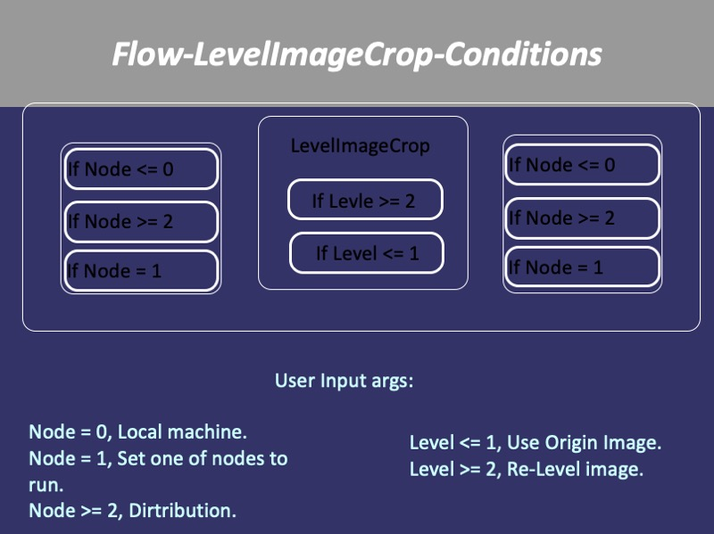

# NCHCCROP
A very very old distributed image split/crop practice using Bash and ImageMagick.

## 前言
超大高解析度影像切割/截圖/切圖，大約是在2006~2007年間對大型空照/衛照圖原始圖轉換成in-house displayer, TSB, Google Map等可用的LoD多解析度小圖需求下，利用12+1的電腦叢集(TDW, tiled display wall  cluster)將各切圖task藉由ssh分散到各節點中執行，檔案則放在master node的/shm(仿ram disk)中讓各節點可以同時access。本專案完全使用BASH語法，多數是在計算與處理一些切割檔案的尺寸變數而已，最後由ImageMagick的convert工具進行裁切。

ps.現在的電腦可輕易處理切圖請見 - [簡單做法](#簡單做法)

## 注意
* 僅供回憶Bash語法使用
* 在需要做很多層LoD時效能比較好，如果只是單張大圖切一層，現在的PC/notebook的效能都會比分散式的好喔。
* 只限在已經設好ssh通行的環境(PC叢集一般沒問題都預設好ssh-key了)

## Run
1. Pre-Run

For ROOT dir setup. Place "export NchcTsbCropRootDir=[Where the script dir]" or write in ~username/.bashrc.
It will be need to get home dir.
CROPHOME="$NchcTsbCropRootDir"
INCLUDE="$CROPHOME/include"

2. How to run

You can run LevelImageCrop for 1.[image leveling] 2.[Crop image to setting piece size].
Or just run MainImageCrop in local machine for [Crop image to setting piece size].

	./LevelImageCrop
	./DistriImageCrop
	./MainImageCrop

NOTE:
DsitriNodeDirPrefix="/scratch/local" is for medusa, if you want run on your machine you should change some dir parameter.
if DsitriNodeDirPrefix not be set. the $OUTDIR will become /$OUTDIR
---->>""$DsitriNodeDirPrefix"/"$DistriOutImage""
--->> ""/"$DistriOutImage" -->> /OUTDIR in root path not local path.

## Method

==============================================

## 簡單做法

現在單機切圖很方便，以MacBookPro單機切圖JPL PIA23405.tif TIFF 15950x6500為例，執行在google 雲端硬碟且無warm up下，需時8.2秒。

	清一下暫存
	▶ rm tiles/*

	▶ identify taoyuan_airport.tif_2.tif
	 taoyuan_airport.tif_2.tif TIFF 7629x6993 7629x6993+0+0 8-bit sRGB 152.635MiB 0.010u 0:00.006

	▶ time magick taoyuan_airport.tif_2.tif -crop 2000x2000 tiles/tiles%03d.jpg

	 ===============
	 CPU    328%
	 User    6.029
	 System    1.897
	 Total    2.415

	 ▶ time magick taoyuan_airport.tif_2.tif -crop 500x500 tiles/tiles%03d.jpg

	 ===============
	 CPU    140%
	 User    3.541
	 System    1.084
	 Total    3.286

	 ▶ identify Taipei2tif.tif
	Taipei2tif.tif TIFF 13343x15752 13343x15752+0+0 8-bit sRGB 601.327MiB 0.030u 0:00.028

	▶ time magick Taipei2tif.tif -crop 1000x1000 tiles/tiles%03d.jpg

	 ===============
	 CPU    260%
	 User    22.540
	 System    7.132
	 Total    11.383

	 ▶ ls -l tiles | wc -l
	     225

	▶ time magick Taipei2tif.tif -crop 200x200 tiles/tiles%03d.jpg

	===============
	CPU	26%
	User	14.571
	System	3.618
	Total	1:08.55 (?)

	▶ ls -l tiles | wc -l
	    5294

	▶ identify PIA23405.tif
	PIA23405.tif TIFF 15950x6500 15950x6500+0+0 8-bit sRGB 170.014MiB 0.000u 0:00.008 

	▶ time magick PIA23405.tif -crop 1024x1024 tiles/tiles%03d.jpg

	===============
	CPU    157%
	User    9.587
	System    3.319
	Total    8.201

	▶ ls -l tiles | wc -l                                         
	     113

